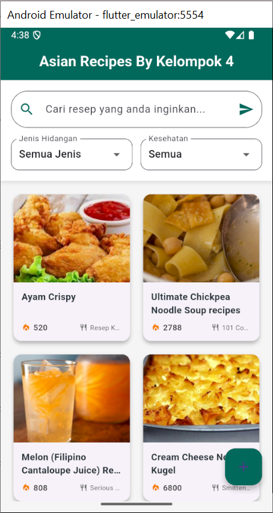
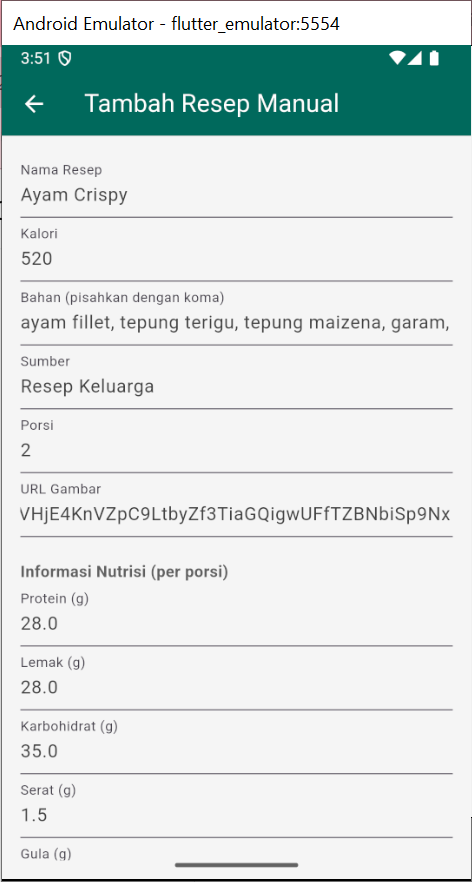
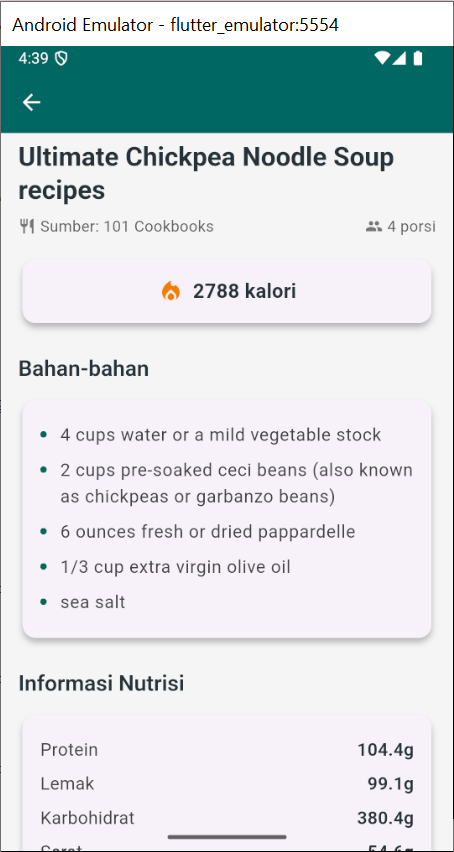
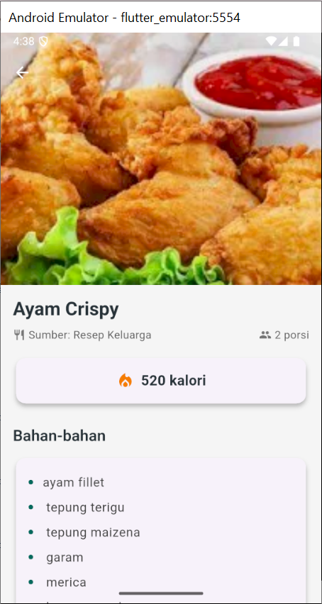

# 📱 Aplikasi Resep Masakan Asia - Kelompok 4

Aplikasi Flutter sederhana yang menampilkan daftar resep masakan Asia menggunakan API Edamam dan juga memungkinkan pengguna menambahkan resep secara manual ke dalam database lokal SQLite.

## 🧩 Fitur Utama

- 🔍 Pencarian resep berdasarkan kata kunci, jenis hidangan (sarapan, makan siang, dll), dan label kesehatan.
- 📦 Menampilkan informasi detail dari resep termasuk kalori, bahan, label diet dan kesehatan, serta nutrisi.
- 📝 Menambahkan resep secara manual yang akan disimpan di SQLite lokal.
- 🧽 Menghapus resep manual berdasarkan label.
- 🌐 Menampilkan sumber resep dari internet.

## 📸 Tangkapan Layar

### Beranda

### Tambah Resep Manual

### Detail Resep

### Resep Manual Tersimpan

## 📦 Teknologi yang Digunakan

- Flutter
- Dart
- Edamam API
- SQLite (sqflite)
- Android Studio / VS Code

## ⚙️ Cara Menjalankan

1. Clone repositori:
   git clone https://github.com/username/nama-project.git
   cd nama-project
   
2. Install dependencies:
   flutter pub get

3. Jalankan di emulator atau perangkat:
   flutter run

## 🙋 Kelompok 4

- Fitri Atika Salwa (4522210080)
- Gina Annisa (4522210154)
